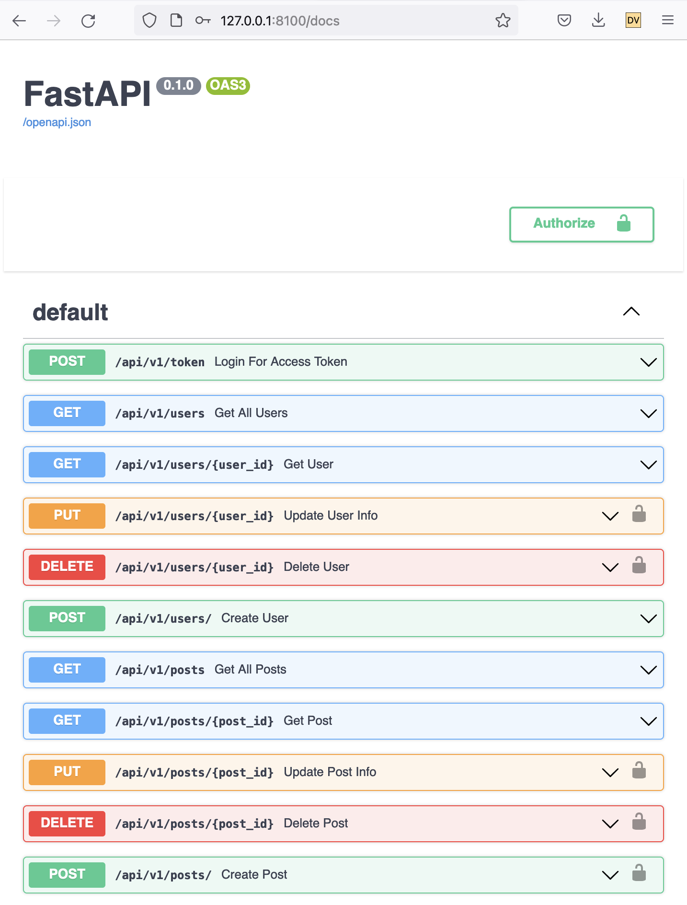

# FastAPI blog API
### Goals
Project goal is to learn technologies:
* REST API
* Unit testing
* Relational database
* Database migrations
* Docker container creation and use

### General description
Blog backend API is implemented.
User can read, create, update, and delete blog posts and users using REST API.

Each user has *user_id*, *username*, *hashed password*, *email*, *name*, and *surname*. Each post has author's *user_id*, *title*, and *body* (plain text).

Implemented:
* users: read, create, update, delete
* posts: read, create, update, delete
* Authentication (using the [official tutorial](https://fastapi.tiangolo.com/tutorial/security/oauth2-jwt/)
and [tutorial from christophergs.com](https://christophergs.com/tutorials/ultimate-fastapi-tutorial-pt-10-auth-jwt/)):
  * fastapi's OAuth2 + JWT token
* Basic authorization:
  * user can not update or delete another user
  * user can not update or delete another user's post
  * You need to be logged in to create a post

### Project structure

* ```blog/``` – source code, python 3.5+ 
* ```config``` – docker files, requirements, environment variables
* ```db_migrations``` – SQL scripts for database migrations
* ```docs``` – pics for README.MD
* ```tests``` – unit tests, run with *pytest*
* ```README.MD``` – you are currently reading it
* ```docker-compose.yml``` – how to start containers, how they are connected
* ```tests_api``` – API tests. Run after docker containers are up & running
* ```start_debug.sh```, ```stop_debug.sh``` – scripts for deploying & testing code locally
* ```yoyo.ini``` – configs for yoyo migrations utility

## Start in debug mode
Use the following script to deploy database and web server in two separate containers in debug mode

```./start_debug.sh```

Containers will be started locally, the code from local source directory will be mapped to the container, pytest will run.
This code is auto-reloaded by uvicorn.
If you don't wand this mapping, just run ```docker-compose up```.

Dismantle containers:

```./stop_debug.sh```

Start web api and database container manually:

```docker-compose -f docker-compose.yml -f config/docker-compose-debug.yml up -d```

In debug mode the code inside container is mapped to local directory.
If you change the code, the web server will reload it on the fly.
After deployment open [http://127.0.0.1:8100/docs](http://127.0.0.1:8100/docs)

### Login & password for testing
Press the ``Authorize`` button to log in:

Default passwords
1. For user with *user_id*=1 you can use password *11*
2. For user with *user_id*=2 you can use password *22*


## Production deployment

Build docker images

```docker-compose -f docker-compose.yml -f config/docker-compose-prod.yml build```

Start docker containers using docker-compose

```docker-compose -f docker-compose.yml -f config/docker-compose-prod.yml up -d```

As a result, application is deployed at [http://127.0.0.1:8100/docs](http://127.0.0.1:8100/docs)

## Tests

User and Post read/create is tested using pytest.

Run unit tests:

```python3 -m pytest --no-header --tb=no tests/```

Run api (integration) tests:

```python3 -m pytest --no-header --tb=no tests_api/```

Comments:
* ```python3 -m``` is used instead of 'pytest tests_unit/' to include source directory into python path
* ```--tb=no```  (to traceback) allows to hide long stack traces if exception raised when running test

## Database

* PostgresSQL 14, Built using docker, default port 5432
* Admin username: **blog_admin**, database: **blog_db** 
* Password is set using environment variables in ```config/env/debug/database.env``` and ```env/production/database.env``` for debug and production correspondingly.
See template with all necessary env variables in ```config/env/template/database.env```. 

### yoyo migrations

Before running migrations, you should provide username, password and database names through environment variables, see template at ```env/template/webapi.env```.

set environment:

```export $(cat config/env/debug/webapi.env | xargs)```

Basic commands:
* list migrations ```yoyo list```
* apply migrations ```yoyo apply```
* rollback last migration ```yoyo rollback```
* rollback all migrations ```yoyo rollback --all```

SQL migration scripts (DDLs) are in ```db_migrations/```

YOYO configuration file: ``yoyo.ini``

#### How to log into the database
using **blog_admin** credentials remotely

``psql -h 127.0.0.1 -p 5432 -U blog_admin -d blog_db``

#### Postgres DB initialization:
Database should be pre-configured before starting the app:
1. Login into docker using superuser **postgres** credentials  
```docker exec -it fastapi_blog_database_1 psql -U postgres```
2. Create database **blog_db**  
```create database blog_db;```<br/>
3. Create role **blog_admin** and with for password  
```CREATE ROLE blog_admin WITH LOGIN PASSWORD 'YOUR_PASSWORD' CREATEROLE;```
4. Let **blog_admin** create, update, delete tables   
```GRANT ALL PRIVILEGES ON DATABASE blog_db TO blog_admin;```
5. Enable PGCRYPO extension
```CREATE EXTENSION pgcrypto;```

## useful asyncio links:
1. [Developing with asyncio](https://docs.python.org/3/library/asyncio-dev.html#developing-with-asyncio)
2. An executor can be used to run a task in a different thread or even in a different process to avoid blocking the OS thread with the event loop. See the loop.run_in_executor() method for more details.
[example](https://docs.python.org/3/library/asyncio-eventloop.html#asyncio.loop.run_in_executor)
3. ```asyncio.wait_for``` – use timeout
4. [how asyncio works internally](https://tenthousandmeters.com/blog/python-behind-the-scenes-12-how-asyncawait-works-in-python/)